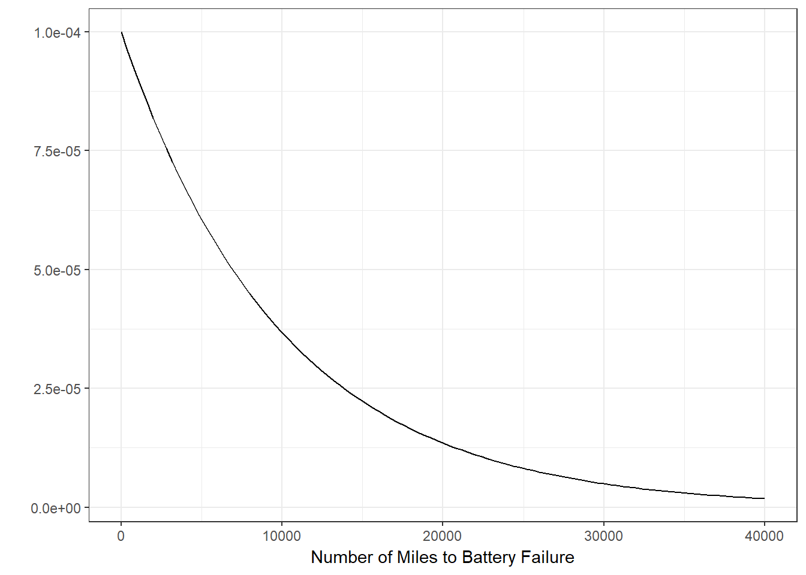

```{r setup, include=FALSE}
knitr::opts_chunk$set(echo = TRUE)
```

```{r load_packages, echo=FALSE, warning=FALSE, message=FALSE}
library(tidyverse)
library(broom)
```


## Exercise 1 - Sampling Distributions, Functions and For Loops (10 points)

Recall that the distribution of the sample mean is approximately a Normal distribution, and that the standard error is $\frac{\sigma}{\sqrt{n}}$. This holds true regardless of the distribution of our population.

For this problem, assume that the number of miles that a particular car can run before its battery wears out is exponentially distributed with an average of 10,000 miles. The exponential distribution looks like this:

```{r e_1_q_fig, echo=FALSE, out.width = '73%'}

```

The exponential distribution has a rate parameter that controls how quickly the distribution decays and defines what the mean and standard deviation will be. In our case the `rate = 1/10000`, the `mean = 10000` and the `standard deviation = 10000`. You can sample from this exponential distribution in R using this code:

```{r e_1_q_1, eval=FALSE}
# sample size
samp_size <- 100
# set the rate parameter
samp_rate <- 1/10000

# take sample
rexp(n = samp_size, rate = samp_rate)
```

### STEP 1

**Write an R function that does the following:**

* **Takes a sample of size `samp_size` from this exponential distribution (`samp_size` is an input parameter for the function)**
* **Calculates the mean of that sample**
* **Calculates the standard deviation of that sample**
* **Returns the calculated mean and standard deviation as a list**

*Helper code*

```{r e_1_q_2, eval=FALSE}
samp_fun <- function(samp_size, samp_rate) {
  
...your code here...
  
stats <- list(samp_avg = samp_avg, samp_std_dev = samp_std_dev)
return(stats)
}
```

Here is the code for the desired function:

```{r e_1_s1}
samp_stats <- function(samp_size, samp_rate) {
  
  sample <- rexp(n = samp_size, rate = samp_rate)
  
  samp_avg <- mean(sample)
  samp_sd <- sd(sample)
  
  stats <- list(samp_avg = samp_avg, samp_std_dev = samp_sd)
  return(stats)
}
```


### STEP 2

**Then write a loop that does this:**

* **Runs the above function 1000 times, with `samp_size = 50` and `samp_rate = 1/10000`**
* **Saves all of the sample means in a vector called `sample_means`, and all of the sample standard deviations in a vector called `sample_sds`**

Here is the desired code:
```{r e_1_s2}
# No. of iterations.
N <- 1000
# Sample size.
n <- 50

# Output Vectors.
sample_means <- rep(NA, N)
sample_sds <- rep(NA, N)

for (i in 1:N) {
  stats <- samp_stats(n, 1/10000)
  sample_means[i] <- stats$samp_avg
  sample_sds[i] <- stats$samp_std_dev
}
```

### STEP 3

**Then**

* **plot your sample means as a histogram**

```{r e_1_s1_a}
ggplot(data.frame(samp_avg = sample_means), aes(x = samp_avg)) +
  geom_histogram(binwidth = 200) + xlab("Sample Averages") + theme_bw()
```
&nbsp;

* **output the standard deviation of your sample means**

```{r e_1_s1_b}
paste("Standard Deviation of sample means is", round(sd(sample_means), 2))
```
&nbsp;

* **calculate the theoretical standard error ($\sigma = 10000$, `n = sample size`)**

```{r e_1_s1_c}
paste("Theoretical Standard Error is", round(10000 / sqrt(n), 2))
```
&nbsp;

* **calculate the mean of the sample standard deviations and use this to calculate the empirical standard error**

```{r e_1_s1_d}
paste("Mean of sample Standard Deviations is", round(mean(sample_sds), 2), 
      "and Emperical Standard Error is", round(mean(sample_sds) / sqrt(n), 2)) # Using sample SD.
```


### STEP 4

**Repeat `STEP 2` and `STEP 3` using a sample size of `500` and `5000`.**

Repeating `STEP 2` and `STEP 3` using a sample size of 500:
```{r e_1_s4_a, message=FALSE, fig.height=3.5}
n <- 500 # Sample size.
sample_means <- sample_sds <- rep(NA, N) # Output Vectors

# Run the function 1000 times, with samp_size = 500 and samp_rate = 1/10000
for (i in 1:N) {
  stats <- samp_stats(n, 1/10000)
  sample_means[i] <- stats$samp_avg
  sample_sds[i] <- stats$samp_std_dev
}

# Plot the sample means as a histogram
ggplot(data.frame(samp_avg = sample_means), aes(x = samp_avg)) +
  geom_histogram(fill = "red") + xlab("Sample Averages") + theme_bw()

# Output the standard deviation of the sample means
paste("Standard Deviation of sample means is", round(sd(sample_means), 2))

# Calculate the theoretical standard error
paste("Theoretical Standard Error is", round(10000 / sqrt(n), 2))

# Calculate the empirical standard error
paste("Mean of sample Standard Deviations is", round(mean(sample_sds), 2), 
      "and Emperical Standard Error is", round(mean(sample_sds) / sqrt(n), 2))
```
\pagebreak
Repeating `STEP 2` and `STEP 3` using a sample size of 5000:
```{r e_1_s4_b, message=FALSE, fig.height=3.5}
n <- 5000 # Sample size.
sample_means <- sample_sds <- rep(NA, N) # Output Vectors

# Run the function 1000 times, with samp_size = 5000 and samp_rate = 1/10000
for (i in 1:N) {
  stats <- samp_stats(n, 1/10000)
  sample_means[i] <- stats$samp_avg
  sample_sds[i] <- stats$samp_std_dev
}

# Plot the sample means as a histogram
ggplot(data.frame(samp_avg = sample_means), aes(x = samp_avg)) +
  geom_histogram(fill = "green") + xlab("Sample Averages") + theme_bw()

# Output the standard deviation of the sample means
paste("Standard Deviation of sample means is", round(sd(sample_means), 2))

# Calculate the theoretical standard error
paste("Theoretical Standard Error is", round(10000 / sqrt(n), 2))

# Calculate the empirical standard error
paste("Mean of sample Standard Deviations is", round(mean(sample_sds), 2), 
      "and Emperical Standard Error is", round(mean(sample_sds) / sqrt(n), 2))
```
\pagebreak

## Exercise 2 - Linear Regression (5 points)

For this exercise we will return to the House Prices prediction dataset that we used for HW 7. You should have already downloaded the `train.csv` dataset before, but if you didn’t you can download it from Canvas in this week’s module.

**Load the `train.csv` dataset into R and fit a regression model with:**

* **`y = SalePrice`**
* **Features: `LotArea`, `OverallQual`, and `ExterQual`**

Here is the code to load data and fit a linear regression model:
```{r e_2_s1, message=FALSE}
train_data <- read_csv('train.csv') # Load csv data file.
model <- lm(formula = SalePrice ~ LotArea + OverallQual + ExterQual, data = train_data)
```

**Answer these questions:**

* **Use the broom package to output the coefficients and the R-squared**

```{r e_2_s2_a}
tidy(model)
glance(model)
```
&nbsp;

* **Interpret the coefficient on `LotArea`**

Controlling for all other features, if the `LotArea` increases by 1 unit, the `SalePrice` increases by $1.45 on average.
\newline

* **Interpret the coefficient on `ExterQualGd`**

`SalePrice` for houses with `ExterQualGd`(Good exterior material quality) are on average $71,529.49 lower than the houses with `ExterQualEx`(Excellent) while controlling for all other features.
*PS: There are no entries in training data with `ExterQual` value `Po`(Poor).*
\newline

* **Compare this model to the model we fit in HW 7 with `GrLivArea`, `OverallQual`, `Neighborhood`. Which is the better fitting model?**

This model has the adjusted-R-squared value of 0.69 which is lower than the adjusted-R-squared value of 0.78 achieved with the model we fit in HW 7 with `GrLivArea`, `OverallQual`, `Neighborhood`. It means that the current model explains variability in data lesser when compared to the model built in HW 7. Hence, the model from HW 7 was a better fitting model.
\pagebreak


## Exercise 3 - AB Testing (5 points)

Download the `ab_test_data.csv` file from Canvas. This file contains two columns: `version` and `conversion`. Each row is a visitor to a webpage. The `version` column tells us which version of the webpage the visitor saw, and the `conversion` column is a binary value and equals `1` if the visitor converted (`0` otherwise).

**We want to perform an AB test on this data to see if the conversion rates are different for the two versions of the webpage.**

Reading the data file:
```{r e_3_s1}
ab_test_data <- read_csv('ab_test_data.csv')
```
&nbsp;

**Answer these questions:**

a. **What proportion of visitors converted for each version of the webpage?**

```{r e_3_s2_a}
ab_test_data %>%
  group_by(version) %>%
  summarise(
    conversion_rate = 100 * mean(conversion),
    num_converted   = sum(conversion),
    num_visited     = n()
    )
```

4.15% visitors converted on version A and 10% visitors converted on version B of the webpage.
\newline

b. **Perform the AB test in R. What is the p-value for the AB test (hypothesis test of proportions)?**

Performing the A/B test using proportion test:
```{r e_3_s2_b}
test_results <- prop.test(c(83, 200), c(2000, 2000))

# p-value
test_results$p.value
```

Since the p-value for the A/B test is less that 0.05 ($\alpha$), we can reject the Null Hypothesis that version A and B of the webpage have same conversion rate. This means that our alternate hypothesis is accepted and version A and B have statistically significant differences in conversion rates.